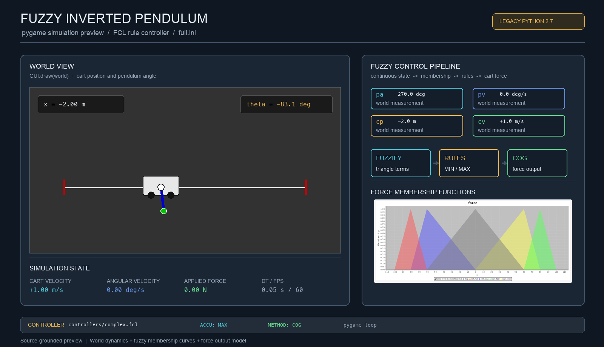

# Fuzzy Inverted Pendulum Control

> **Recommended repository name:** `fuzzy-inverted-pendulum-control`
>
> **About:** Python/Pygame inverted-pendulum simulator driven by an interpretable fuzzy-rule controller that maps motion state to cart force.



## Overview

Fuzzy Inverted Pendulum Control is an educational simulation of a cart that must keep a pendulum balanced while moving horizontally. The project combines a physics update loop, a Pygame visualization, configurable physical parameters, and controller definitions written in Fuzzy Control Language (FCL).

This is an **interpretable AI/control project built around fuzzy logic**. Instead of learning a policy from a training dataset, it represents control knowledge with membership functions and readable IF/THEN rules. The controller converts measurements such as pendulum angle, angular velocity, cart position, and cart velocity into fuzzy degrees, evaluates the rule base with MIN/MAX operators, and is designed to produce a continuous force for the cart through center-of-gravity defuzzification.

The repository contains both a `pyfuzzy` FCL integration and a manual fuzzification/inference path. That makes it useful for studying the full control pipeline, while also leaving a clear refactoring opportunity: one inference path should eventually become the single source of truth.

## Control pipeline

```mermaid
flowchart LR
    W[World state<br/>cp · cv · pa · pv] --> F[Fuzzification<br/>membership degree]
    C[controllers/*.fcl<br/>terms and rules] --> F
    F --> R[Rule evaluation<br/>AND = MIN · OR = MAX]
    R --> D[Defuzzification<br/>METHOD = COG]
    D --> U[Cart force]
    U --> S[Simulator.tick(dt)]
    S --> W
    S --> G[Pygame GUI]
```

At each simulation step, `Manager` reads the current state, asks `FuzzyController` for a force, applies that force to `Simulator`, advances the cart/pendulum dynamics, and redraws the world. The FCL files make the decision policy inspectable: terms such as `up_left`, `ccw_slow`, `left_fast`, and `stop` describe the controller’s vocabulary instead of hiding it inside an opaque model.

## What is included

- A physics model for cart position, velocity, acceleration, pendulum angle, angular velocity, and angular acceleration.
- A Pygame view with a horizontal rail, boundary walls, cart, pendulum rod, and bob.
- `simple.fcl`, which uses pendulum angle and angular velocity as controller inputs.
- `complex.fcl`, which also declares cart position and cart velocity and defines the full `InvertedPendulum` control block.
- Manual membership parsing in `fuzzification.py` and rule extraction/evaluation in `inference.py`.
- Existing membership-function charts for angle, cart position, cart velocity, angular velocity, and force in `images/`.
- Configuration files that change simulation timing, monitor dimensions, controller selection, and physical parameters without editing Python source.

## Fuzzy decision process

1. `World` stores the physical state. `FuzzyController._make_input()` exposes it as `cp`, `cv`, `pa`, and `pv`.
2. The FCL files define triangular or shoulder-shaped membership terms over those variables.
3. The fuzzification layer estimates how strongly the current value belongs to each linguistic term.
4. The rule base combines terms such as `(pa IS up_right) AND (pv IS ccw_slow)` and maps them to a force term.
5. The FCL configuration specifies `ACCU : MAX`, `METHOD : COG`, and a default force of `0`, providing the intended aggregation and defuzzification behavior.
6. The resulting force is applied to the cart before the next physics update.

This design is valuable because a control decision can be inspected and explained in terms of angle, motion, rules, and force rather than only a numerical prediction.

## Getting started

The source targets the original Python 2.7 environment and legacy versions of Pygame, `configparser`, `pyfuzzy`, and the ANTLR runtime. A modern Python 3 installation will not run the project unchanged because the code contains Python 2 `print` statements and depends on older packages.

### Install the historical dependencies

Use an isolated Python 2.7 environment if you want to reproduce the original setup:

```bash
python2.7 -m pip install -r requirements
```

The repository also includes the original dependency archives and the `install-deps.sh` helper:

```bash
./install-deps.sh
```

Because several dependencies are obsolete, installation may require a compatible legacy environment or a controlled modernization of the dependency list.

### Run the simulator

Use the default configuration:

```bash
python2.7 main.py
```

Run the larger monitor and complex controller configuration:

```bash
python2.7 main.py configs/full.ini
```

The program opens a Pygame window and runs continuously at the configured frame rate. Close the window or interrupt the process when finished.

## Configuration

`conf.py` selects `configs/default.ini` when no argument is provided, or loads the path supplied on the command line.

| Configuration | Controller | Key simulation settings |
| --- | --- | --- |
| `configs/default.ini` | `controllers/simple.fcl` | `dt = 0.1`, `fps = 60`, initial angle `-90°` |
| `configs/full.ini` | `controllers/complex.fcl` | `dt = 0.05`, `fps = 60`, `1600×400` monitor, `x = -2`, `v = 1`, `l = 2` |

The physical model parameters include cart mass `M`, pendulum mass `m`, pendulum length `l`, friction `b`, moment of inertia `I`, gravity `g`, cart bounds, and applied force. `World` converts the configured angle from degrees to radians.

## Repository map

| Path | Responsibility |
| --- | --- |
| `main.py` | Application entry point; wires configuration, world, controller, and manager |
| `world.py` | Physical state and model parameters |
| `simulator.py` | Dynamics integration, position limits, angle normalization, and force reset |
| `gui.py` | Pygame rendering of the cart, rail, walls, and pendulum |
| `manager.py` | Main loop, timing, controller calls, physics updates, and rendering |
| `controller.py` | FCL loading and controller input/output integration |
| `fuzzification.py` | Membership-range parsing and manual fuzzification |
| `inference.py` | FCL rule parsing and MIN/MAX rule evaluation |
| `defuzzification.py` | Defuzzification extension point |
| `controllers/simple.fcl` | Angle/angular-velocity controller |
| `controllers/complex.fcl` | Expanded inverted-pendulum controller |
| `configs/*.ini` | Runtime and physical-parameter configuration |
| `images/*.png` | Membership-function charts from the project |

## Implementation status

The simulation and control ideas are clearly represented, but the checked-in source is a legacy prototype rather than a ready-to-run modern package. In particular:

- `Simulator.tick()` and `GUI.draw()` contain the core physics and visualization behavior.
- `FuzzyController` loads FCL through `pyfuzzy` and also calls the manual fuzzification/inference helpers.
- `defuzzification.py` currently contains a placeholder function.
- `controller.py` currently returns an undefined `out` variable from `decide()`, so the controller-to-simulator force path needs to be completed before the loop can run reliably.
- The code uses Python 2 syntax, while the current environment generally provides Python 3.
- The project includes generated `.pyc` files and archived dependencies from its original environment.

These limitations are documented so the repository’s scientific idea remains clear without overstating the current runtime state.

## Engineering roadmap

A strong next version would:

1. Port the application to Python 3 and Pygame 2 with a small, pinned dependency file.
2. Select one inference implementation: either a maintained FCL engine or a tested native Python pipeline.
3. Implement defuzzification and return `output['force']` from the controller with explicit force bounds.
4. Add unit tests for membership functions, rule parsing, rule aggregation, angle wrapping, and physics boundary behavior.
5. Separate the simulation core from Pygame so the controller can be tested headlessly and run in CI.
6. Record state, rule activations, and force over time for reproducible experiments and controller comparisons.
7. Add configuration validation, structured logging, and a graceful shutdown path.

## Existing analysis outputs

The repository already contains charts for:

- Pendulum angle membership terms in `images/pendulum_angle.png`
- Pendulum angular velocity in `images/pendulum_angular_velocity.png`
- Cart position in `images/cart_position.png`
- Cart velocity in `images/cart_velocity.png`
- Force output terms in `images/force.png`

The generated preview at the top of this README combines the actual force membership chart with a source-grounded recreation of the Pygame world and control loop.

## License

No license file is currently included. Add a license before distributing or reusing the project as a library.
